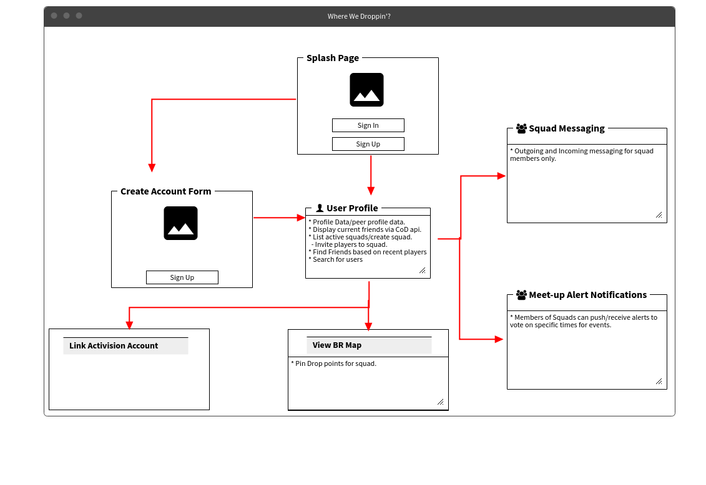

# CoD: Modern Warfare Stat Finder

## Description
### _This is an application that allows users to create their own profiles and view their own, or other user's game data pulled from the Call of Duty Modern Warfare API._

## Time-log
### 7/24/20 _from the previous repo_
* 8-10: Spent some time to look over alternative project ideas. Considering changing project towards a messaging app and may utilize tutorial to do so. 
https://www.youtube.com/watch?v=jFNHerJqvFw
* 10:30-12: Time spent adding code in reference to previous projects to capstone project.
* 1:30-3: Troubleshooting complier errors being received in the console.
* 4-5: Reconsidering new MVP approach.

### 7/27/20
* 8-10: Scrap old repo, create new project repository for fresh start in API calls

### 7/28/20
* 8-9:30: Project setup on new machine
* 10-12: TroubleShooting Compling errors, begin set up for hitting API requests.
* 1-2: Setting up signin form to take username and password. 
* 2-5:30: Encountering errors in console.log(API) placement. Making attempts to view data in the browsers DevTools

### 7/29/20 
* 8-9:50: Encountering account linking issues with Activision and Playstation network. Searching for alternative accounts to present data. https://www.callofduty.com/
* 10:00: Retrieve another account to hit endpoints of the call-of-duty-api with.
* 10-12: Now Receiving a Promise. Making efforts to fetch the object. Encountering two errors in the console reading 'Refused to set unsafe header "Cookie"', and 'xhr.js:123 Refused to set unsafe header "Connection"'.
* 1:30-4:15: Making attempts to isolate and review other individuals work with the same api in handling this request.
* 9:30-10:23pm: Utilizing rapidApi's Modern Warfare public api. Able to recieve endpoints from the browser, although not within postman. Testing further.
* 10:23-2:06am, 7/30/20: Time was spent refactoring the API call to display user data. I ditched the API I was using, intially requiring user authentication to display information. Information can now be searched by inputting a username and associated platform to the new Search() method.
### Points of Interest to Pursue
* Display the user's data to the page
## User Stories:

| Component | Story |
|---|---|
| Data Retrieval | Users can retrieve their CoD profile data by linking their Activision account with their user profile. |
| View Data of Peers | Users can review other's profiles to reference. |
|||  

## Project Stretch Goals

| Component | Story |
|---|---|
| User Profile| Existing users can signin to their Activision Accounts |
| User Profile| New users can create an Activision Account |
| Pin to Map | Users can view and add pins to the Battle Royal map |
| Add a Friend| Users can find new players to add as friends |
| Create Squads | Users can add friends to a squad |
| Squad Messaging | Users can live message one another within their respective squads. |
| Meetup Alerts | Users can setup alerts to notify squad members of proposed meet-times. |

## Installation Instructions

1. Visit this link https://github.com/assassin56/capstoneV2
 
2. Clone this repo by selecting the "clone or download" button. This will allow you to copy the repo's link.

3. While on the command line in your terminal, enter "git clone" followed by the copied url.

4. Enter "ls" to show a list of files and documents. One of them will be labeled "capstone". Use "cd" followed by the project directory name to navigate there.

5. While in project directory, run the command "npm install"

6. While in project directory, run "npm start"

7. Type in your browser the url "localhost:3000" to access the page, or the page should load upon running the previous command.

8. To view data being requested from the api, open the browser console with CMD+SHIFT+J (CONTROL+SHIFT+I, for windows).

## Known Bugs
* _When searching for users consisting of a '#' in their name, typcically associated to battle.net or Activision (uno) ID platoforms, a parsing error occurs. The application is only able to make search queries on console users at the moment._

## Technologies Used

* Node.js
* Webpack
* npm
* Javascript
* React

This project was bootstrapped with [Create React App](https://github.com/facebook/create-react-app).

### Diagrams

## Available Scripts

In the project directory, you can run:

### `npm start`

Runs the app in the development mode. 
Open [http://localhost:3000](http://localhost:3000) to view it in the browser.

The page will reload if you make edits. 
You will also see any lint errors in the console.

### `npm test`

Launches the test runner in the interactive watch mode. 
See the section about [running tests](https://facebook.github.io/create-react-app/docs/running-tests) for more information.

### `npm run build`

Builds the app for production to the `build` folder. 
It correctly bundles React in production mode and optimizes the build for the best performance.

The build is minified and the filenames include the hashes. 
Your app is ready to be deployed!

See the section about [deployment](https://facebook.github.io/create-react-app/docs/deployment) for more information.

### `npm run eject`

**Note: this is a one-way operation. Once you `eject`, you can’t go back!**

If you aren’t satisfied with the build tool and configuration choices, you can `eject` at any time. This command will remove the single build dependency from your project.

Instead, it will copy all the configuration files and the transitive dependencies (webpack, Babel, ESLint, etc) right into your project so you have full control over them. All of the commands except `eject` will still work, but they will point to the copied scripts so you can tweak them. At this point you’re on your own.

You don’t have to ever use `eject`. The curated feature set is suitable for small and middle deployments, and you shouldn’t feel obligated to use this feature. However we understand that this tool wouldn’t be useful if you couldn’t customize it when you are ready for it.

## Learn More

You can learn more in the [Create React App documentation](https://facebook.github.io/create-react-app/docs/getting-started).

To learn React, check out the [React documentation](https://reactjs.org/).

### Code Splitting

This section has moved here: https://facebook.github.io/create-react-app/docs/code-splitting

### Analyzing the Bundle Size

This section has moved here: https://facebook.github.io/create-react-app/docs/analyzing-the-bundle-size

### Making a Progressive Web App

This section has moved here: https://facebook.github.io/create-react-app/docs/making-a-progressive-web-app

### Advanced Configuration

This section has moved here: https://facebook.github.io/create-react-app/docs/advanced-configuration

### Deployment

This section has moved here: https://facebook.github.io/create-react-app/docs/deployment

### `npm run build` fails to minify

This section has moved here: https://facebook.github.io/create-react-app/docs/troubleshooting#npm-run-build-fails-to-minify
